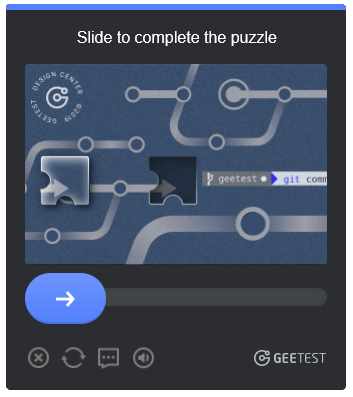
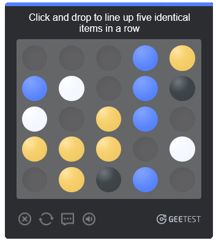
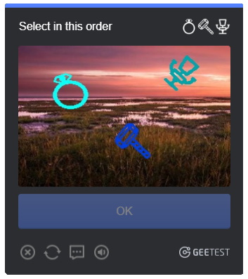

# Geetest v4 solver

<div>
    
    <br>
    
    
    
</div>

**Base Version**: v1.9.7-fc2ddc  
**This Fork**: 针对 Geetest v4 图标点选（icon）验证码深度定制，实测通过率 **95%**

---

# ⭐️ Show Your Support

Please star the repository if you find it useful! Your support helps improve the project. ❤️

---

## Disclaimer

本仓库基于上游 [xKiian/GeekedTest](https://github.com/xKiian/GeekedTest) 定制，支持 **risk_type** `slide`、`gobang`、`icon`、`ai` 四种类型。图标点选（icon）做了深度优化，其余类型保持上游原样。

**本仓库仅供个人学习、安全研究或获得明确授权的测试使用。** 自动化绕过验证码可能违反目标网站的服务条款，请遵守相关法律法规，不要用于未授权的商业用途。

---

## 目录

- [项目简介](#项目简介)
- [当前状态](#当前状态)
- [快速开始](#快速开始)
- [获取 captcha_id 和 risk_type](#获取-captcha_id-和-risk_type)
- [使用示例](#使用示例)
- [项目结构](#项目结构)
- [本仓库的改造](#本仓库的改造)
- [训练自定义模型](#训练自定义模型)
- [日志系统](#日志系统)
- [常见问题](#常见问题)
- [上游说明](#上游说明)
- [License](#license)

---

## 项目简介

Geetest v4 是极验推出的第四代验证码系统，包含四种验证类型：

| 类型 | 说明 |
|---|---|
| `slide` | 滑块拼图 |
| `gobang` | 五子棋点选 |
| `icon` | 图标点选（**本仓库重点优化**） |
| `ai` | 无感验证 |

**本项目目标**：用 Python 实现极验 v4 的自动化求解，尤其是**图标点选**类型。

---

## 当前状态

| 验证类型 | 上游支持 | 本仓库状态 |
|---|---|---|
| `slide` | ✅ | ✅ 保持兼容 |
| `gobang` | ✅ | ✅ 保持兼容 |
| `ai` | ✅ | ✅ 保持兼容 |
| **`icon`** | ⚠️ ddddocr（精度有限） | ⭐ **自训练 YOLO，通过率 95%** |

### 图标点选通过率对比

| 版本 | 训练数据 | fliplr | 实测通过率 |
|---|---|---|---|
| v7（基线） | 500 张人工 | 0.5 | 40–65%（波动大） |
| v10 | 1000 张人工 | 0.5 | 40–50% |
| **v11b（推荐）** | **1000 张人工** | **0.0** | **95%** ✅ |

---

## 快速开始

### 环境要求

- Python 3.10+
- Windows / Linux / macOS
- （可选）NVIDIA GPU + CUDA 12.8，用于训练

### 安装

```bash
# 1. 克隆仓库
git clone <your-repo-url>
cd GeekedTest

# 2. 安装运行时依赖
pip install -r requirements.txt

# 3. （可选）如果需要训练
pip install torch torchvision torchaudio --index-url https://download.pytorch.org/whl/cu128
pip install -r requirements-train.txt